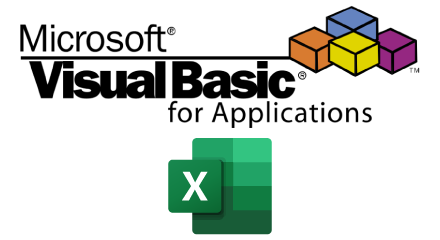

    
<a href="https://github.com/Maux/vba-codes" alt="VBA-CODES" title="Códigos de VBA para Microsoft&reg; Excel"></a>

  
 <strong>Aviso Legal</strong>

  <blockquote>
    <h3>Repositório de Códigos em VBA (Visual Basic for Applications) para Microsoft&reg; Excel.</h3>
Repositório destinado para códigos (módulos, módulos de classe, formulários) e planilhas de exemplo em Microsoft&reg; Excel, com o objetivo de ajudar, informar e disseminar esta linguagem de programação. Os códigos estão comentados em inglês, para uma maior abrangência de usuários. Nenhum código ou planilha disponíveis neste repositório, tem a intenção de prejudicar ou danificar o sistema operacional ou a máquina que será executado. É de responsabilidade do usuário a aplicação e/ou o uso do conteúdo deste repositório. A performance de execução dos códigos e/ou planilhas, pode variar dependendo dos recursos de cada máquina.

    
Este repositório não possui vínculos e/ou qualquer parceria com a Microsoft Corporation&reg;. Os logos VBA & Excel são marcas registradas Microsoft Corporation&reg;, detentora de seus direitos autorais.

  </blockquote>

  
 <strong>Disclaimer</strong>

  <blockquote>
    <h3>Code Repository in Visual Basic for Applications (VBA) for Microsoft&reg; Excel.</h3>
Repository intended to codes (modules, class modules, forms) and sample spreadsheets in Microsoft Excel&reg;, in order to help inform and disseminate this programming language. The codes are commented in English, for a wider range of users. No code or spreadsheet available in this repository, intends to harm or damage the operating system or the machine that will run. User is responsible for the application and / or use of the contents of this repository. The performance of the implementation of codes and / or spreadsheets, can vary depending on the features of each machine.

    
This repository does not have any links and / or any partnership with Microsoft Corporation&reg;. VBA & Excel logos are registered trademarks Microsoft Corporation&reg;, which owns its copyright.
</blockquote>

<em>&copy; Copyright 2020 by <strong><a href="https://maux.github.io/mypage/" alt="Maux" target="_blank">Maux</a></strong>. All Rights Reserved.</em>
