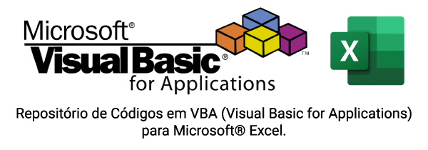

### [Códigos de VBA para Microsoft ® Excel](https://github.com/Maux/vba-codes)

   

  
 <strong>Repositório para Códigos de VBA para Microsoft© Excel</strong>

  
Este reposítorio contém códigos, módulos, modulos de classe e planilhas de exemplos em Excel.

  
Sempre que possível, os códigos serão comentados em inglês, para uma maior abrangência  de usuários.

  
Os códigos são revisados e alterados, dependendo da necessidade.

  
Nenhum código fará qualquer alteração no sistema operacional ou no computador, mas é de responsabilidade do usuário, o uso que ao qual o código será aplicado.

  
A velocidade de execução de alguns códigos pode variar dependendo dos recursos disponíveis do computador em execução, ou da base de dados envolvidas na execução do código.

  
Este respositório não tem nenhum vinculo ou parceria com a empresa Microsoft© e tem por objetivo, ajudar e a disseminar esta linguagem de programação.

  
Os logos VBA & Excel são marcas registradas pela Corporação Microsoft, detentora de sesu direitos autorais.

  
 <strong>Repository for VBA Codes for Microsoft© Excel</strong>

  
This repository contains codes, modules, class modules and spreadsheet examples in Excel.

  
Whenever possible, codes will be commented in English, for a wider range of users.

  
The codes are revised and changed, depending on the need.

  
No code will make any changes to the operating system or computer, but it is the user's responsibility, that the use to which the code is applied.

  
The some code execution speed may vary depending on the available resources of the computer running, or database involved in code execution.

  
This repository has no bond or partnership with Microsoft © company and aims to help and to disseminate this programming language.

  
VBA & Excel logos are registered trademarks of Microsoft Corporation, which owns its copyright.

<em>&copy; Copyright Reserved by [Maux](https://maux.github.io/mypage/) - Brasil 2020.</em>
